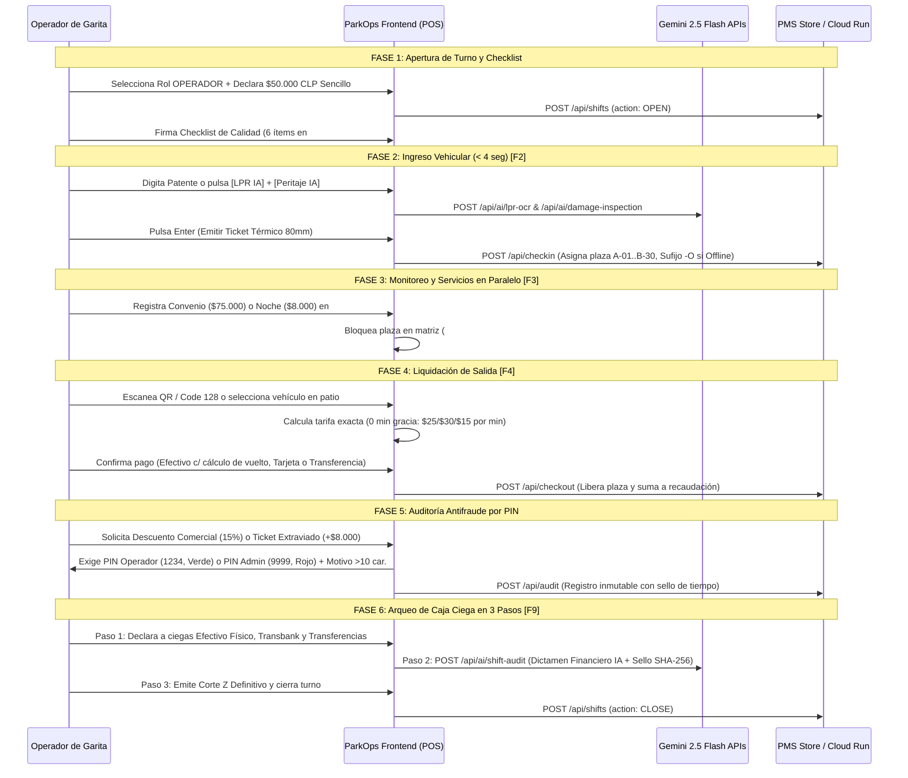

# Especificación de Diseño UI/UX, Flujo Operativo de 6 Fases y Tokens v4.5 (ParkOps PMS)

> **Sistema de Diseño**: Linear App / Vercel Dashboard Enterprise Wireframe  
> **Tipografía Oficial**: `Plus Jakarta Sans` (UI & Encabezados) + `JetBrains Mono` (`tabular-nums` para patentes, montos CLP, relojes y hashes `SHA-256`)  
> **Restricción Estructural**: Cero imágenes o videos incrustados; conservación exclusiva de `[ Slot Wireframe ]` punteados en `#view-landing`.

---

## 1. Flujo Operativo Canónico de 6 Fases en Garita (Serrano 447)

---

## 2. Arquitectura de Tokens de Diseño (`globals.css`)

### 2.1 Superficies y Bordes (Estilo Linear / Vercel)
- **Fondo General de Aplicación**: `#f4f6f9` (`--surface-app`)
- **Tarjetas y Paneles**: `#ffffff` con borde `1px solid #e8ecf0` y sombra multicapa `0 1px 3px rgba(0,0,0,0.06), 0 1px 2px rgba(0,0,0,0.04)`
- **Inputs y Controles**: Fondo `#f8fafc`, borde `1.5px solid #dde2e8`, radio `10px`, anillo de foco accesible `:focus-visible` (`2px solid #0f172a`)
- **Chip de Patente Chilena (`.license-plate-chip`)**: Tipografía `JetBrains Mono`, peso `800`, espaciado `0.10em`, borde doble tipo placa física (`#cbd5e1`)

### 2.2 Accesibilidad WCAG AA y Ergonomía (`/web-design-guidelines` & `/modern-web-guidance`)
- **Soporte de Movimiento Reducido**: Regla `@media (prefers-reduced-motion: reduce)` que desactiva animaciones no esenciales para operadores en turnos de 8 horas.
- **Atributos de Entrada**: `inputMode="numeric"` en todos los campos de efectivo, montos y PINs; `autoComplete="off"` en buscadores de patentes y autorizadores antifraude; `aria-label` en botones de acción rápida.
- **Sin Scroll en Garita (`#view-pos`)**: Distribución en grilla de 12 columnas (`7 col` operación de formulario/liquidación + `5 col` tabla compacta de vehículos en patio con altura fija controlada).

---

## 3. Presets de Super-Resolución Documentados en `#view-settings`

Para futuras iteraciones gráficas sobre los `[ Slot Wireframe ]` de la Landing Page, el sistema conserva documentados dos motores de escalado IA:

1. **Magnific AI / Freepik API (`POST /v1/ai/image-upscaler`)**:
   - *Preset A (UI Dashboard Faithful)*: `Creativity: 0 | HDR: 10 | Resemblance: 95 | Fractality: 0`
   - *Preset B (Serrano 447 Architecture)*: `Creativity: +3 | HDR: 45 | Resemblance: 75 | Fractality: 35`
   - *Preset C (CCTV LPR Photographic)*: `Creativity: +2 | HDR: 30 | Resemblance: 80 | Fractality: 20`
2. **Clarity Upscaler Open-Source (`philz1337x` — Tiled MultiDiffusion + ControlNet Tile + `4x-UltraSharp`)**:
   - *Preset 1 (Nitidez UI & Ticket Térmico 80mm)*: `creativity: 0.15 | resemblance: 0.92 | dynamic: 4 | sd_model: juggernaut_reborn`
   - *Preset 2 (Captura Cámara LPR & Fachada Serrano 447)*: `creativity: 0.35 | resemblance: 0.80 | dynamic: 6 | scale_factor: 2 | sharpen: 1.5`
