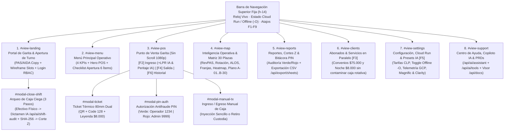

# Mapa de Sitio, Arquitectura de Información y Contratos de API v4.5 (ParkOps PMS & ERP)

> **Proyecto**: ParkOps PMS — Cordano Inversiones Inmobiliarias Ltda. (Serrano 447, Iquique)  
> **Arquitectura Frontend**: Single-Page Operational App (Next.js 16 + React 19 + Tailwind CSS v4)  
> **Filosofía Visual**: Core Funcional Puro & Wireframe Estructural Limpio (Linear App / Vercel Dashboard) — Cero imágenes o videos incrustados.

---

## 1. Mapa de Sitio Estructural (7 Vistas + 4 Modales Críticos)

---

## 2. Mapa de Teclado Ergonómico de Garita (`Keyboard-First`)

| Tecla / Atajo | Acción Operativa Directa | Vista / Contexto |
| :--- | :--- | :--- |
| **`F1`** | Ir al Menú Principal Operativo (`#view-menu`) | Global |
| **`F2`** | Abrir POS en Sub-pestaña **Ingreso Vehicular** + Autofoco en Patente | Global / POS |
| **`F3`** | Abrir Submódulo en Paralelo: **Abonados & Servicio Noche** (`#view-clients`) | Global |
| **`F4`** | Abrir POS en Sub-pestaña **Liquidar Salida** + Autofoco en Buscador | Global / POS |
| **`F5`** | Abrir **Configuración, Tarifas & Contingencia Offline (`-O`)** (`#view-settings`) | Global |
| **`F6`** | Abrir POS en Sub-pestaña **Historial de Tickets del Turno** | Global / POS |
| **`F8`** | Disparar **Pulso de Apertura Manual de Barrera** (`GPIO`) con registro en bitácora | Global / POS |
| **`F9`** | Iniciar **Protocolo de Cierre de Caja Ciega en 3 Pasos** (`#modal-close-shift`) | Global |
| **`Enter`** | Confirmar emisión de Ticket de Ingreso o procesar Liquidación de Salida | Formularios POS |
| **`Esc`** | Cerrar cualquier ventana modal activa (`Ticket`, `PIN`, `Cierre`, ` Caja Manual`) | Global |

---

## 3. Contratos de los 13 Endpoints de API (`src/app/api/*`)

### 3.1 Core Transaccional PMS
1. **`GET /api/slots`**: Retorna las 30 plazas (`A-01..A-15`, `B-16..B-30`) + 5 sobrecupos, contadores de ocupación y estado `offlineMode`.
2. **`POST /api/checkin`**: Valida formato de patente, previene doble ingreso (*Anti-Passback*), asigna plaza y genera correlativo `TKT-AAAAMMDD-T0X-XXXX` (o sufijo `O`).
3. **`POST /api/checkout`**: Calcula estadía exacta con **0 minutos de gracia**, aplica descuentos (con PIN Operador) o recargo por extravío de `$8.000 CLP` (con PIN Admin), registra medio de pago y libera la plaza.
4. **`GET / POST /api/shifts`**: Gestiona apertura de turno con fondo inicial de `$50.000 CLP` y cierre de caja ciega sellado con `SHA-256`.
5. **`GET / POST /api/audit`**: Almacena y consulta eventos de auditoría antifraude clasificados por `color_tag` (`VERDE`, `ROJO`, `AZUL`, `GRIS`).

### 3.2 Inteligencia Artificial Operativa (Gemini 2.5 Flash)
6. **`POST /api/ai/lpr-ocr`**: Conectado al botón `[LPR IA]` en `#pos-subtab-entry`. Extrae matrícula, categoría (`auto`, `camioneta`, `moto`) y nivel de confianza.
7. **`POST /api/ai/damage-inspection`**: Conectado al botón `[Peritaje IA]` en `#pos-subtab-entry`. Redacta acta preventiva de daños preexistentes para proteger a la empresa ante reclamos (SOP-03).
8. **`POST /api/ai/shift-audit`**: Conectado al Paso 2 de `#modal-close-shift`. Emite dictamen financiero automatizado (`nivelRiesgo`: `BAJO | MEDIO | ALTO`) evaluando diferencias de caja, extravíos y descuentos.
9. **`POST /api/ai/assistant`**: Conectado al Centro de Ayuda (`#view-support`). Responde consultas del operador sobre reglas de negocio y SOPs de Serrano 447.
10. **`POST /api/ai/tools`**: Conectado a los botones rápidos de *Function Calling* en `#view-support` (`getParkingStatus`, `calculateParkingFee`, `triggerBarrierPulse`).

### 3.3 Infraestructura Cloud Run, Documentación y Exportación ERP
11. **`GET /api/cloudrun`**: Conectado a `#view-settings`. Expone metadatos del servicio `cordano-pms-v1` en GCP `us-west1`.
12. **`GET /api/health`**: Conectado a `#view-landing` y `#view-settings`. Verifica estado operativo y latencia RTT del contenedor.
13. **`GET /api/docs` & `GET /api/export/sheets`**: Conectados a `#view-support` (lectura en vivo de los 3 PRDs de `docs/`) y `#view-reports` (descarga directa de planilla CSV dinámica con tickets reales del turno).
