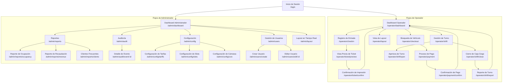

# User Flow — Sistema de Gestión de Estacionamiento

```mermaid
graph TD
  %% Login
  Login["Inicio de Sesión<br/>/login"]

  Login --> DashboardOp
  Login --> DashboardAdmin

  %% Operador Flows
  subgraph "Flujos de Operador"
    DashboardOp["Dashboard Operador<br/>/operator/dashboard"]

    DashboardOp --> CheckIn["Registro de Entrada<br/>/operator/checkin"]
    DashboardOp --> CheckOut["Búsqueda de Vehículo<br/>/operator/checkout"]
    DashboardOp --> LayoutView["Vista de Layout<br/>/operator/layout"]
    DashboardOp --> ShiftManage["Gestión de Turno<br/>/operator/shift"]

    CheckIn --> TicketPreview["Vista Previa de Ticket<br/>/operator/ticket/preview"]
    TicketPreview --> PrintConfirm["Confirmación de Impresión<br/>/operator/ticket/confirm"]

    CheckOut --> PaymentProcess["Proceso de Pago<br/>/operator/payment"]
    PaymentProcess --> PaymentConfirm["Confirmación de Pago<br/>/operator/payment/confirm"]

    ShiftManage --> ShiftOpen["Apertura de Turno<br/>/operator/shift/open"]
    ShiftManage --> ShiftClose["Cierre de Caja Ciego<br/>/operator/shift/close"]
    ShiftClose --> ShiftReport["Reporte de Turno<br/>/operator/shift/report"]
  end

  %% Administrador Flows
  subgraph "Flujos de Administrador"
    DashboardAdmin["Dashboard Administrador<br/>/admin/dashboard"]

    DashboardAdmin --> ReportsView["Reportes<br/>/admin/reports"]
    DashboardAdmin --> AuditView["Auditoría<br/>/admin/audit"]
    DashboardAdmin --> ConfigView["Configuración<br/>/admin/config"]
    DashboardAdmin --> UsersView["Gestión de Usuarios<br/>/admin/users"]
    DashboardAdmin --> LayoutAdmin["Layout en Tiempo Real<br/>/admin/layout"]

    ReportsView --> OccupancyReport["Reporte de Ocupación<br/>/admin/reports/occupancy"]
    ReportsView --> RevenueReport["Reporte de Recaudación<br/>/admin/reports/revenue"]
    ReportsView --> ClientsReport["Clientes Frecuentes<br/>/admin/reports/clients"]

    AuditView --> AuditDetail["Detalle de Evento<br/>/admin/audit/event/:id"]

    ConfigView --> TariffConfig["Configuración de Tarifas<br/>/admin/config/tariffs"]
    ConfigView --> SlotConfig["Configuración de Slots<br/>/admin/config/slots"]
    ConfigView --> CCTVConfig["Configuración de Cámaras<br/>/admin/config/cctv"]

    UsersView --> UserCreate["Crear Usuario<br/>/admin/users/create"]
    UsersView --> UserEdit["Editar Usuario<br/>/admin/users/edit/:id"]
  end

  %% Cross-connections
  PaymentConfirm --> DashboardOp
  PrintConfirm --> DashboardOp
  ShiftReport --> DashboardOp
```
